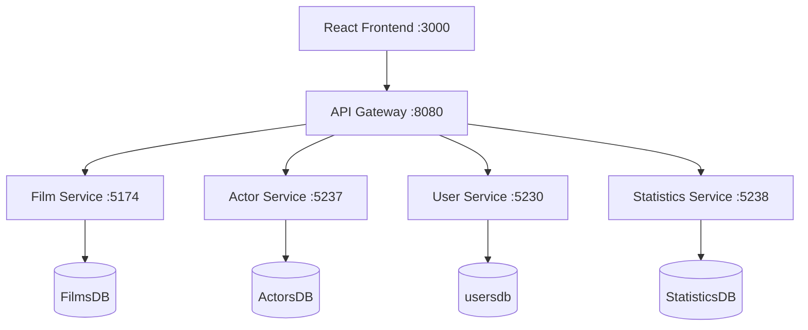

# Casă de Producție Filme – Aplicație microservicii

Aplicație pentru gestionarea producției cinematografice, cu **3 roluri** (angajat, manager, administrator), **5 microservicii backend** + **API Gateway**, și client React multilingv (RO / EN / FR).

## Arhitectură (diagrame)



| Serviciu | Port | Responsabilitate |
|----------|------|------------------|
| **API Gateway** | 8080 | Rutare, CORS |
| **Film Service** | 5174 | Filme, regizori, scenariști, producători, imagini, export CSV/JSON/XML/DOC |
| **Actor Service** | 5237 | Actori, relația film–actor (rol) |
| **User Service** | 5230 | Utilizatori, autentificare, notificări (Observer: Email, SMS, WhatsApp) |
| **Statistics Service** | 5238 | Statistici filme (rating, vizualizări) |

## Cerințe îndeplinite

### Angajat
- Listă filme sortată după tip și an (backend + frontend)
- Detalii: imagini (1–3), regizor, scenarist, **producător**, distribuție actori
- Filtrare (tip, categorie, an), căutare titlu
- CRUD filme
- Export: **CSV, JSON, XML, DOC**

### Manager
- Vizualizare filme (fără CRUD)
- Liste regizori / scenariști / actori cu foto și filme asociate
- Export filme (toate formatele)
- **3+ statistici grafice** (top rating, top vizualizări, distribuție pe categorie)

### Administrator
- CRUD utilizatori, listă, filtrare tip, export CSV
- La modificare utilizator: notificare automată **Email + SMS + WhatsApp** (Observer Pattern)

### UI
- Limbi: **Română, English, Français**

## Pregătire mediu

1. **Java 17+**, **Maven**, **Gradle**, **Node.js 18+**, **MySQL 8**
2. Parolă MySQL: actualizează `root` în fișierele `application.properties` dacă e diferită
3. Creează bazele de date:

```bash
mysql -u root -p < sql/init-databases.sql
```

## Pornire rapidă

```powershell
.\start-all.ps1
```

Sau manual, în ordine: `demo` → `film.service` → `actor-service` → `statistics-service` → `API-gataway` → `casa-productie-frontend` (`npm start`).

Deschide **http://localhost:3000**

### Conturi demo

| Rol | Email | Parolă |
|-----|-------|--------|
| Angajat | angajat@firma.ro | angajat123 |
| Manager | manager@firma.ro | manager123 |
| Administrator | admin@firma.ro | admin123 |

## Pattern-uri GoF (exact 5 – Gang of Four)

| # | Pattern | Unde | Rol |
|---|---------|------|-----|
| 1 | **Strategy** | `film.service` → `FilmExportStrategy`, `CsvExportStrategy`, `JsonExportStrategy`, `XmlExportStrategy`, `DocExportStrategy` | Export filme în CSV / JSON / XML / DOC fără `if` pe format |
| 2 | **Observer** | `demo` → `UserChangeObserver`, `EmailNotificationObserver`, `SmsNotificationObserver`, `WhatsAppNotificationObserver`, `UsersService` | La modificare date autentificare: notificare pe **≥2 canale** (Email, SMS, WhatsApp) |
| 3 | **Factory Method** | `demo` → `NotificationFactory` | Creare notificări după tip (`EMAIL` / `SMS` / `WHATSAPP`) |
| 4 | **Decorator** | `film.service` → `LoggingFilmService` (folosit în `FilmController`) | Logging la operațiile CRUD filme, fără a modifica `FilmService` |
| 5 | **Singleton** | `film.service` → `ExportMetadataSingleton` | Metadate comune (organizație, antet) pentru toate exporturile |

> **API Gateway** și **DAO** sunt pattern-uri arhitecturale utile, dar **nu** intră în cele 5 GoF cerute la proiect.

### Lista filme (angajat + manager)

- Sortare: tip film, apoi an realizare
- Per film: **1–3 imagini** (coloană în tabel + modal Detalii), regizor, scenarist, producător, distribuție cu rol

## Structură proiect

```
proiect_intermediar_3/
├── API-gataway/          # Spring Cloud Gateway
├── demo/                 # User Service (Maven)
├── film.service/         # Film Service (Maven)
├── actor-service/        # Actor Service (Gradle)
├── statistics-service/   # Statistics Service (Gradle)
├── casa-productie-frontend/
├── sql/init-databases.sql
└── start-all.ps1
```
